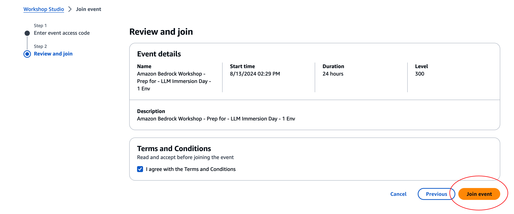
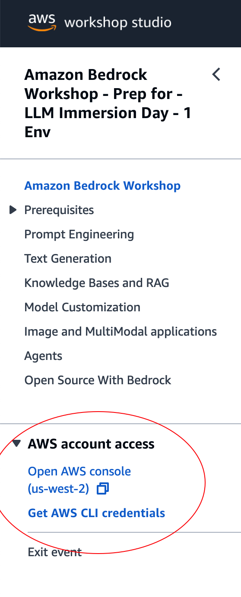
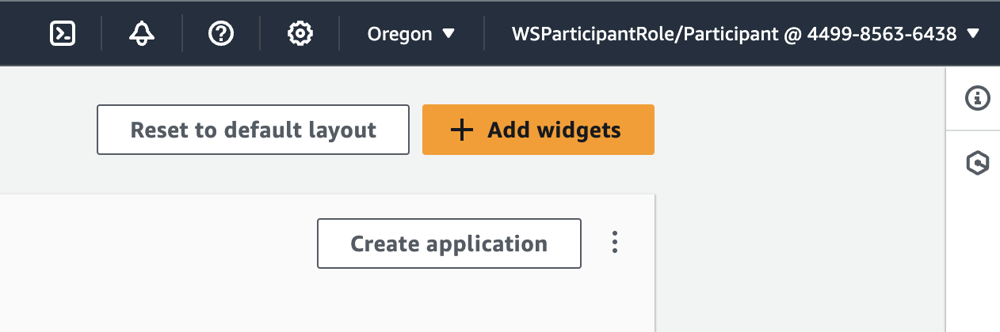

## AWS Workshop link

   

## Setup new AWS Overview

Click on the following link [workshop aws env](https://catalog.us-east-1.prod.workshops.aws/join?access-code=2fe8-03a0fe-75) to join AWS workshop ,open the link and review the terms and conditions and click **"Review and Join"** button.

   

## Connect to AWS Console

AWS Workshop Studio will be open now , for our workshop just click on  **"AWS account access"** url to enter AWS console.

   

## Connect to AWS Console

After login make sure your Federated user is **WSParticipantRole/Participant** and the region is **US West 2 (Oregon)**.

   

## [Back to Labs](https://github.com/TeraSky-OSS/aws-bedrock-llm-workshop/tree/main?tab=readme-ov-file#labs-overview)