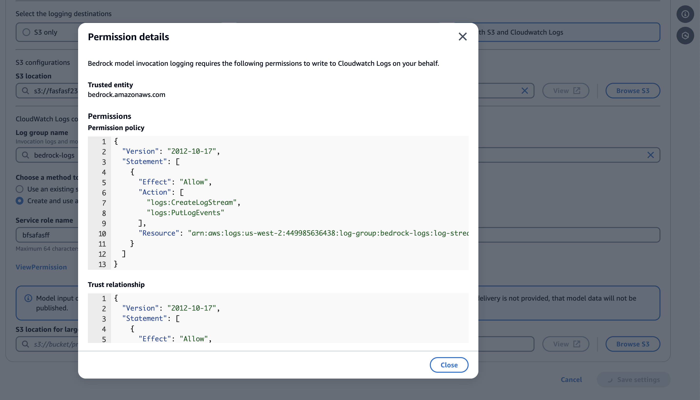
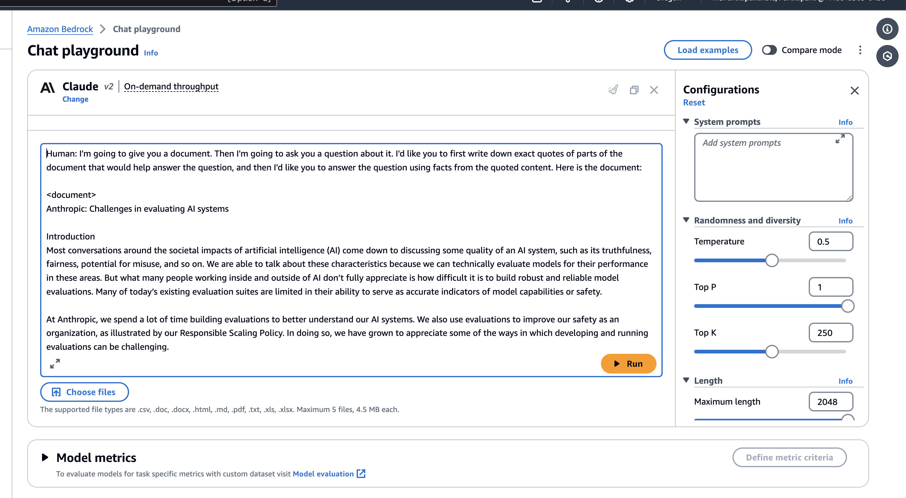

## Monitoring Bedrock with CloudWatch

## Configure CloudWatch Log group and S3 Settings

After choosing your logging destination, create a log group in CloudWatch and an S3 bucket for large data files. Within the Bedrock Settings, link your newly created S3 bucket for large data delivery and finalize the setup by saving your changes.

   

## Create an S3 Bucket for Log Storage

Amazon S3 (Simple Storage Service) offers scalable object storage. When dealing with large amounts of log data or logs that include large files (such as images or embeddings), it's often necessary to store them in an S3 bucket. This step involves:

- Going to the Amazon S3 console.

- Creating a new bucket, which involves specifying a unique name for the bucket and configuring settings such as region, access permissions, and other options depending on your requirements.

S3 buckets are used in conjunction with CloudWatch Logs when logs are too large or in a format that is better suited for S3 storage. It ensures that all data, regardless of size, is stored securely and efficiently, with the flexibility to access and analyze this data as needed.

   

## Enable Model Invocation Logging

To enable logging, access the Bedrock console Settings page via the left navigation bar. Here, you will find the option to toggle Model Invocation Logging, prompting you to specify the types of data to be logged, such as text, images, and embeddings.

To configure logging, navigate to the Settings page in the Bedrock console, from the left navigation bar.

[Settings page](https://us-east-1.console.aws.amazon.com/bedrock/home?region=us-east-1#/settings)

Then toggle the Model invocation logging button which will present you with several fields that will need to be filled out before logging can be enabled.

Next, select your logging destination (**Both S3 & CloudWatch Logs**),

Select your logging destination, where you have three options. The first option is S3 Only which configures Bedrock to only send logs to a S3 bucket of your choice. The second option is CloudWatch Logs only, which sends the logs to CloudWatch and when model input or output data is larger than 100kb or in binary format it can be optionally delivered to S3. The last option is Both S3 & CloudWatch Logs where logs are sent to both S3 & CloudWatch and when model input or output data is larger than 100kb or in binary format data it will only be sent to S3. Whatever option you choose you remain in control of model inputs and outputs, including encryption with KMS and retention duration. In my case I have chosen the CloudWatch Logs only option.

- S3 Only: Directs logs exclusively to an Amazon S3 bucket.

- CloudWatch Logs Only: Sends logs to CloudWatch, with the option to offload larger or binary data to S3.

- Both S3 & CloudWatch Logs: Logs are sent to both destinations, with large or binary data being S3-exclusive.

Each option offers full control over data management, including encryption via KMS and setting data retention durations.

   

   Select new Service Role and see the policy that will be created 

      
   

## Generate log data from Bedrock

Go back to Bedrock and select Playgrounds->Chat

   

Go back to Bedrock and select Playgrounds->Chats , and click on Select Model Claude 2.1 and apply changes

   

Now let's load a pre existing example by clicking on "Load Examples" and select **Advanced Q&A with Citation**
and click "Load In Playground"

   

Now play with the model to generate logs and metrics
   

## Query logs using CloudWatch Logs Insight

CloudWatch Logs Insights enables you to interactively search and analyze your log data in CloudWatch Logs. You can perform queries to help you more efficiently and effectively respond to operational issues.

In the case of Bedrock we can use Log Insights to search and analyze the model invocation logs and search for specific keywords or simply the latest invocation logs

   

## Stream logs using Live Tail

Live Tail in CloudWatch Logs is a feature that provides an interactive log analytics experience that helps you view your logs interactively in near real-time as they are ingested. Live Tail provides customers a rich out-of-the-box experience to view and detect issues in their incoming logs. Additionally, it provides fine-grained controls to filter, highlight attributes of interest, and pause/replay logs while troubleshooting issues

   

## Bedrock Metrics Dashboard Metrics

This CloudWatch dashboard monitors AWS Bedrock model performance, tracking metrics like invocation count, latency, and token usage across different foundation models.

Go to CloudWatch -> Dashboards and select Automatic Dashboards

   

Select Bedrock and the following Dashboard will be presented

   

In dashboard above we are showing the following information:

- The number of invocations over time by model

- Invocation latency by model

- Token count by input and output tokens

- The latest prompts from the invocation logs showing the model, operation, input and output token count.

## Bedrock Metrics Alerms 

Metrics can be used to set alarms that watch for certain thresholds, and then send notifications or take actions when values exceed those thresholds. You can also enable CloudWatch anomaly detection for metrics which applies statistical and machine learning algorithms that continuously analyze metrics, determine normal baselines, and surface anomalies with minimal user intervention.

[CloudWatch anomaly detection](https://docs.aws.amazon.com/AmazonCloudWatch/latest/monitoring/CloudWatch_Anomaly_Detection.html)

   

## [Back to Labs](https://github.com/TeraSky-OSS/aws-bedrock-llm-workshop/tree/main?tab=readme-ov-file#labs-overview)

