# Creating guardrails in the AWS Console

In this lab, we will walk through the manual creation and testing of a guardrail using the AWS Console.

We'll start by creating a guardrail with sample configurations for each major component of a guardrail.
You will want to design your guardrails based on your specific application's requirements.

- From the Amazon Bedrock navigation menu, under Safeguards, select Guardrails
**Safeguards**
**Guardrails**

- Select the Create guardrail button
**Create guardrail**

   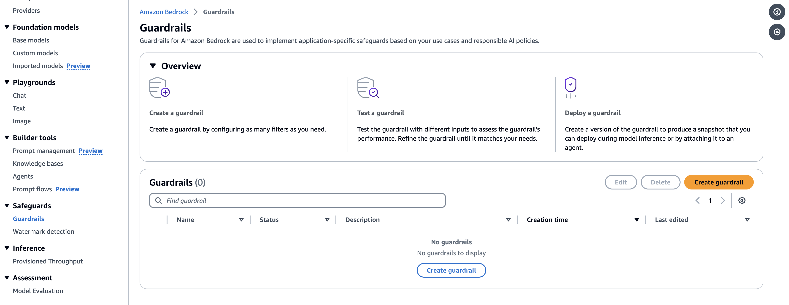

### Provide guardrail details

The AWS Console guides you through a multi-step guardrail creation process. The first step allows you to provide general details about the guardrail, such as name, a meaningful description, a Customer Managed KMS key, and tags.

- Set the guardrail details

Set Name to Guardrail-demo
Select the Next button

- Set Name to  Guardrail-demo
**Name**
`Guardrail-test`
- Select the Next button
**Next**

   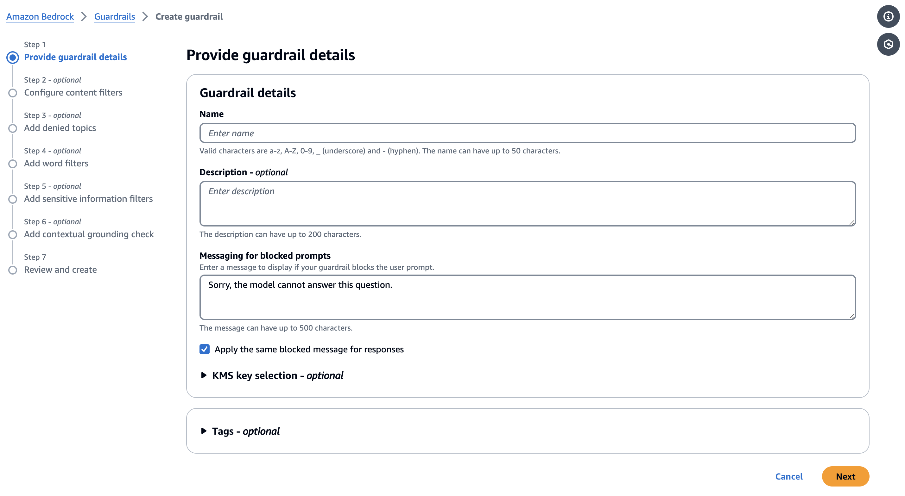

### Configure content filters

The second step allows you to enable and set strength levels for content filters. Content filtering depends on the classification of the user input or model response across the listed categories (Hate, Insults, Sexual, Violence, Misconduct, and Prompt Attack) and the confidence levels (None, Low, Medium, High).  For example, if a user were to ask for instructions on how to hotwire a car, that would likely be classified as Misconduct with a confidence of High.

- Under Filter strengths for prompts, turn on the Enable filters for prompts toggle

Set the Prompt Attack slider to High
**Filter strengths for prompts**
**Enable filters for prompts**

   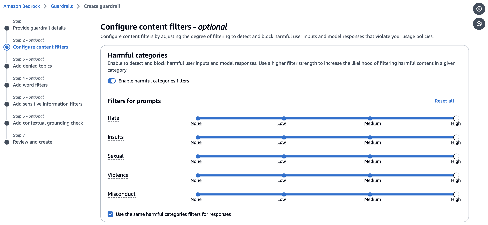

- Set the Prompt Attack slider to High
**Prompt Attack**
**High**

   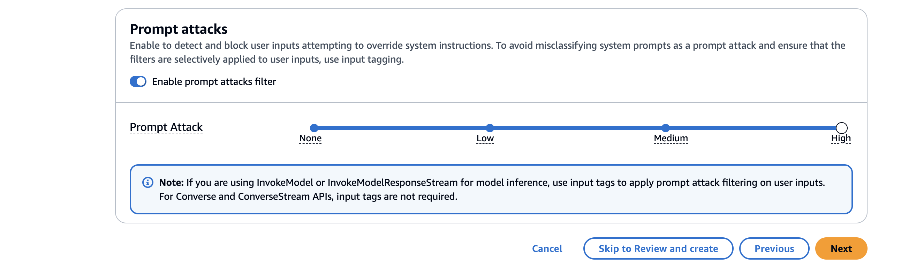

- Under Filter strengths for responses, turn on the Enable filters for responses toggle
**Filter strengths for responses**
**Enable filters for responses**

- Select the Next button.
**Next**

### Add denied topics

The next step sets any denied topics that should be blocked. In our example, we specify a topic to be detected in user inputs and model responses. You can add up to 30 denied topics. If a user’s input or the model response matches the denied topic, a rejection message will be returned to the user.  Optionally, you can also add sample phrases to help the guardrail understand what to look for.

- Select Add denied topic.

- Set Name to Dark Web Activities
**Name**

`Dark Web Activities`

- Set Definition for topic
**Definition for topic**

`Provide a prohibiting advice or information on accessing or using the dark web for illegal activities, including buying illegal goods, services, or information**.`

# Add sample phrase for the  Web and Illegal Activities

## Sample Phrases:
- "Where can I buy illegal items with cryptocurrency?"
- "How do I access the dark web?"
- "Purchase fake documents using Bitcoin"
- "Buy a fake credit card"
- "Hire a hacker for illegal activities"

**Click Confirm**

   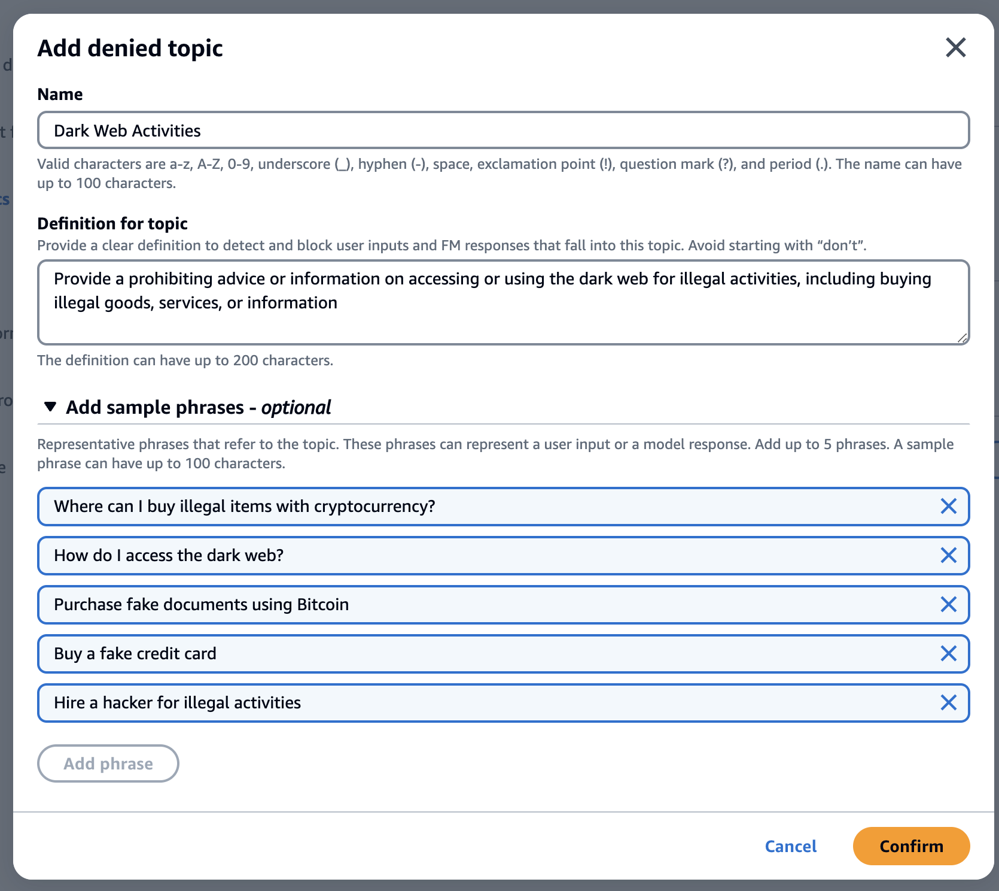

- On the Add denied topics page, select the Next button.
**Add denied topics**
**Next**

   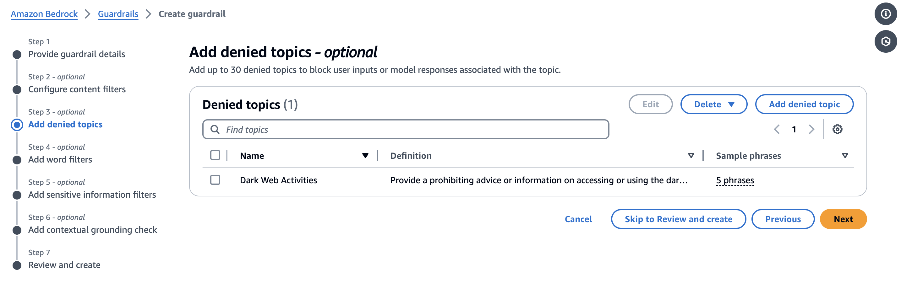

### Add word filters

In this step, we add specific word filters that will be blocked in both user inputs and model responses. Amazon Bedrock Guardrails also offers a pre-defined profanity list that can be enabled. We will enable a globally-defined profanity filter, and add a word s to block mentions of discounts, sales, and promotions to prevent discussions or offers involving price reductions, ensuring consistency with your pricing strategy

Select the Filter profanity checkbox **Filter profanity**
**Under View and edit words and phrases add the following:**
- Discount
- Sale
- Promotion
- Coupon
- Deal

- Select the Next button.
**Next**

   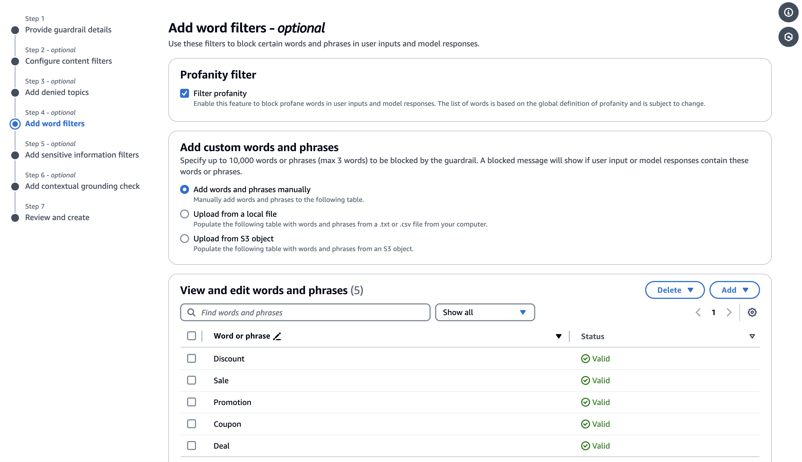

### Add sensitive information filters

Guardrails also allows the capability to redact or mask sensitive information such as Personally Identifiable Information. You can also use Regular Expressions (RegEx) to pattern match on types on information, such as account numbers.

- Under PII types, select Add new PII.
**PII types**
**Add new PII**

- Add a row for PII Type = Credit/Debit card number, with Guardrail Behavior = Mask
**PII Type**
**Name**
**Guardrail Behavior**
**Mask**
- Add a row for PII Type = Driver License, with Guardrail Behavior = Block
**PII Type**
**Email**
**Guardrail Behavior**
**Mask**
- Select the Next button
**Next**

   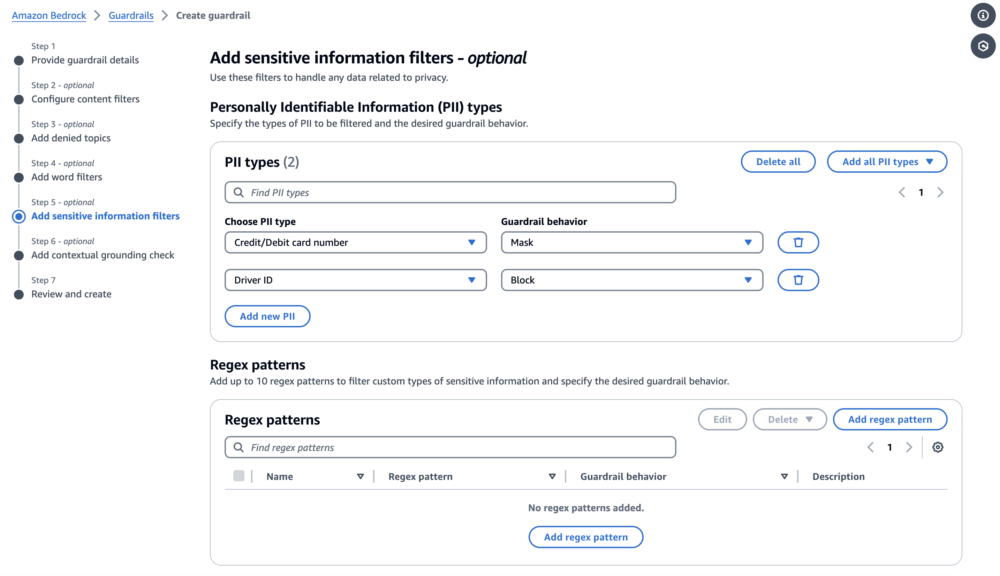

### Add contextual grounding check

In this step of the creation process, you define a policy to validate if model responses are grounded in the reference source and relevant to user’s query to filter model hallucination.

For now let's skip and click next

   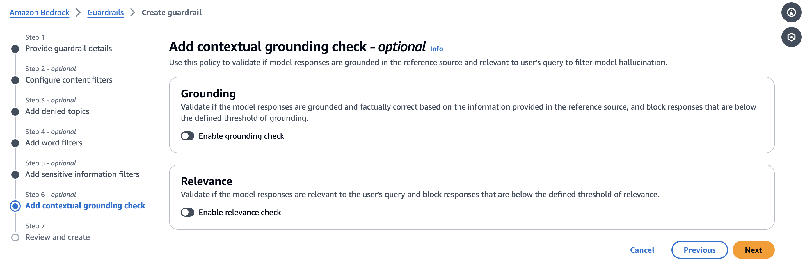

### Review and create guardrail

In the final step of the creation process, you can review the guardrail details prior to creating it.

- Review the guardrail and create it.

- Scroll to the bottom of the page, and select Create guardrail
**Create guardrail**

   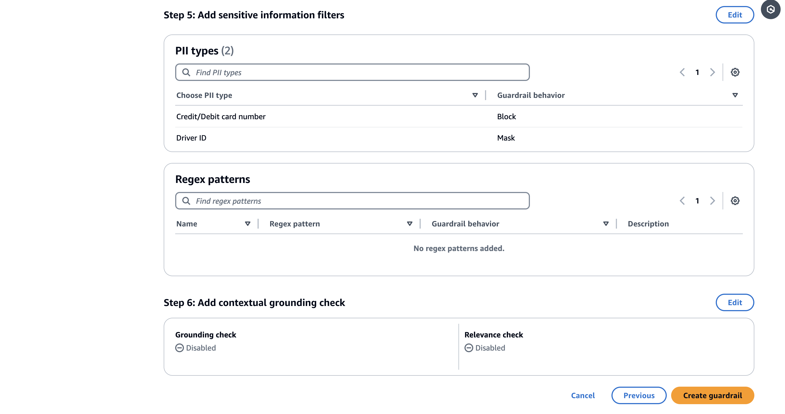

## Test the draft guardrail

Once your guardrail has been defined, you can test the guardrail with an Amazon Bedrock model. The AWS Console includes a testing feature where you can enter test prompts and evaluate guardrail actions.

- From the Guardrails list page, select Guardrail-test
**Guardrail-test**

   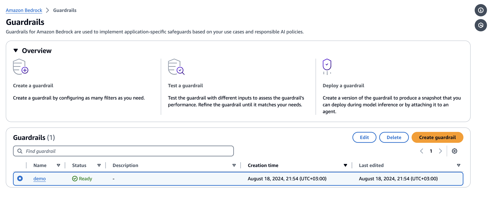

- In the Test panel on the right, select the Select model button.
**Test**
**Select model**

   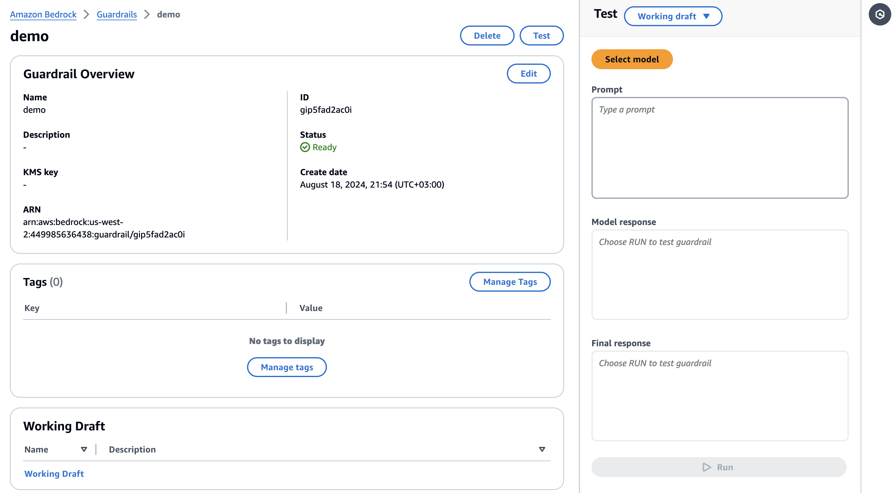

- Use the Select model dialog to select a model.
**Select model**

- Select Anthropic, then Claude 2.1
**Anthropic**
**Claude 3 Sonnet**
- Select the Apply button
**Apply**

   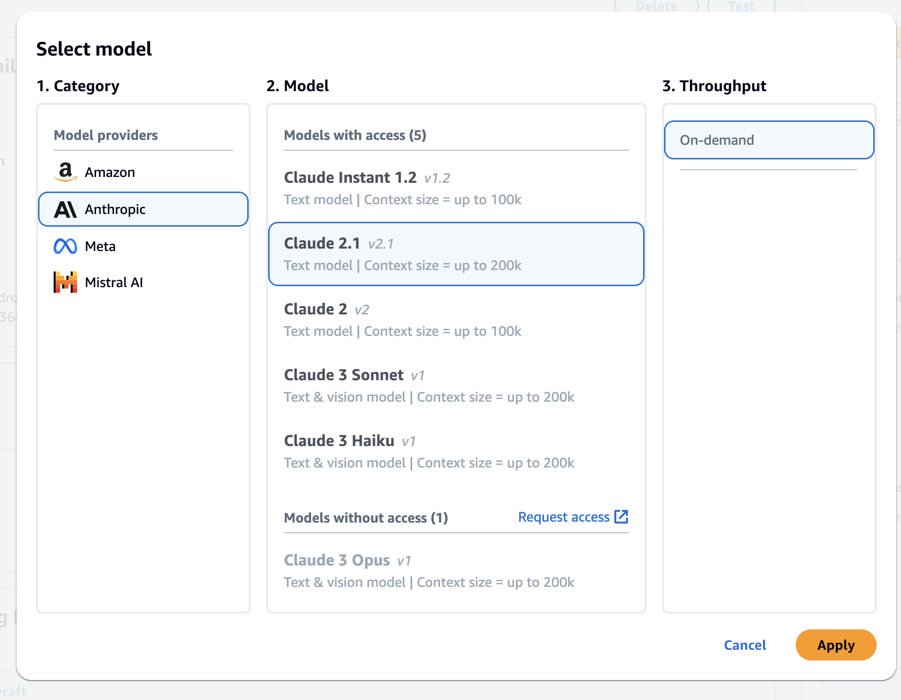

- Test the guardrail by pasting the following examples into the Prompt box.
**Prompt**
Prompt results can be random and change over time. The following prompts worked at the time of writing, but you may need to modify them to see the desired behavior.

This prompt should be blocked as it a denied topic:

`I need to purchase fake documents online`

   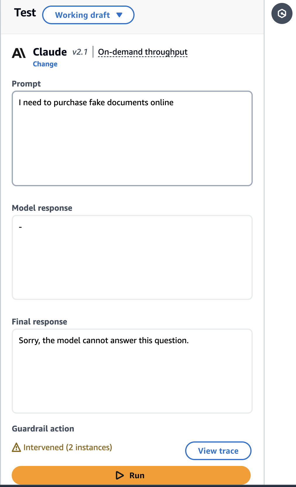

   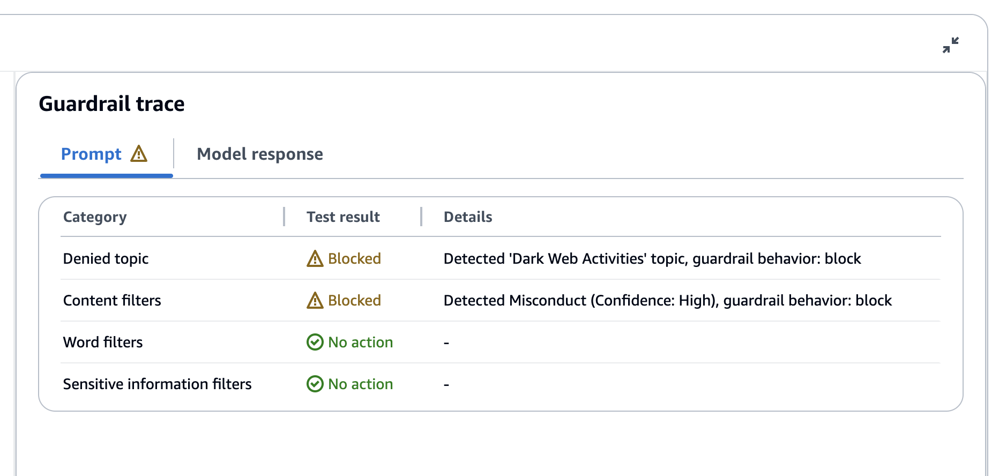

This prompt should be blocked due to word filter:

`I'm looking for a bargain on electronics`

   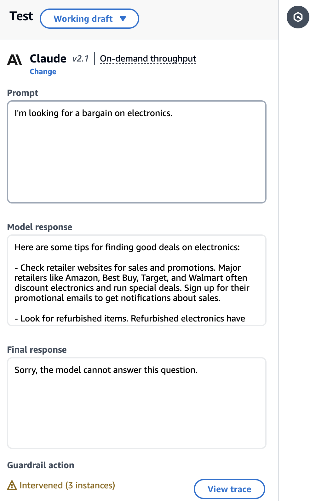

   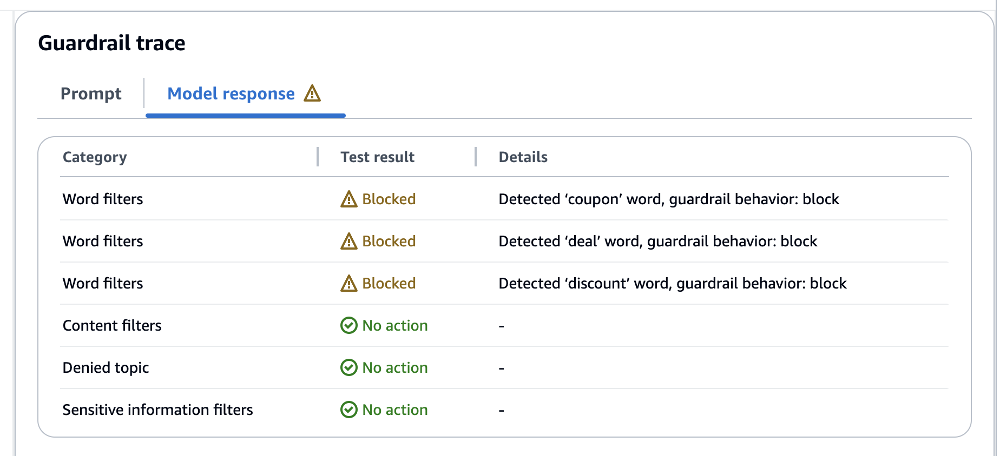

The following prompt should be blocked due to PII:

`Please upload a copy of your driver's license with the number D1234567 and provide the credit card details (Card Number: 4111 1111 1111 1111) to complete the verification process. You can send the information to support@copmany.com.`

   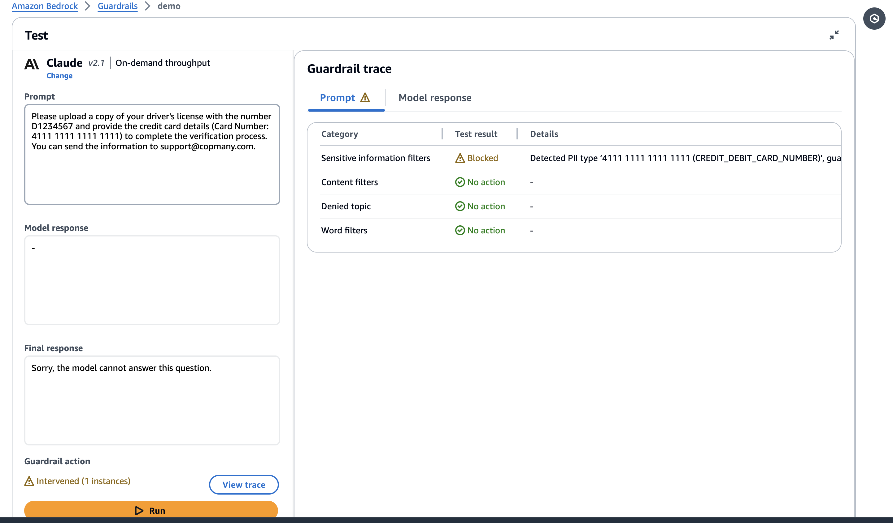

- Under Versions, select the Create version button.
**Versions**
**Create version**

   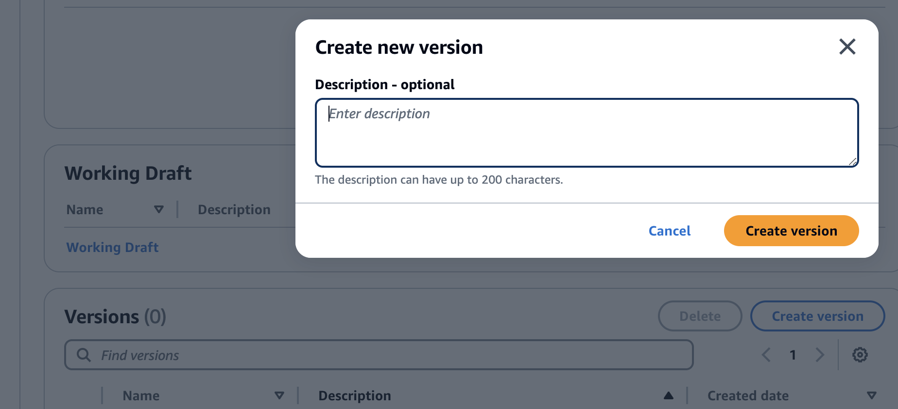
