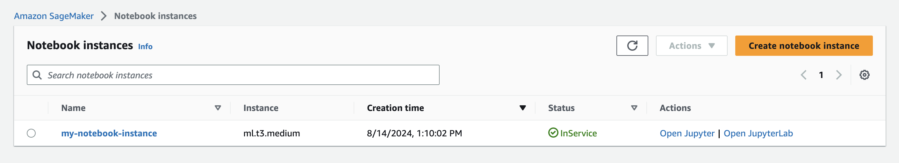
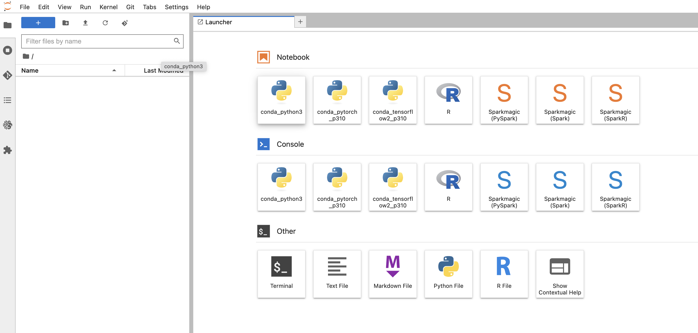
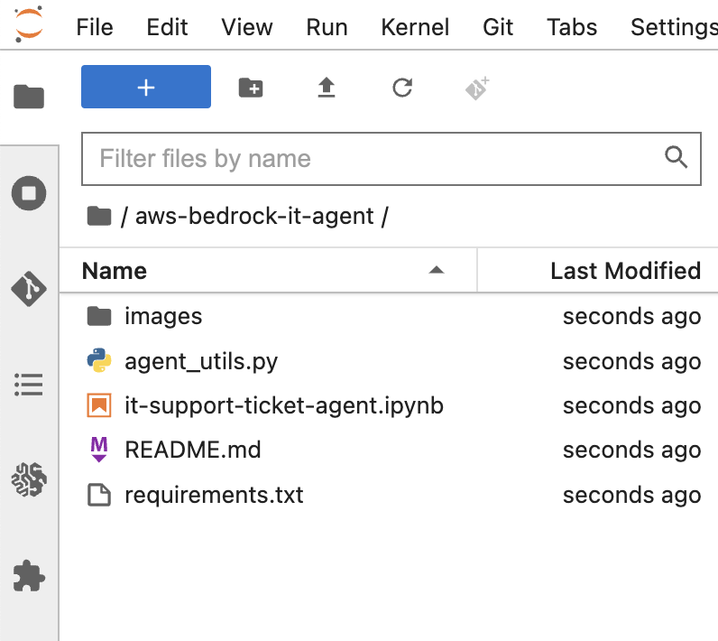
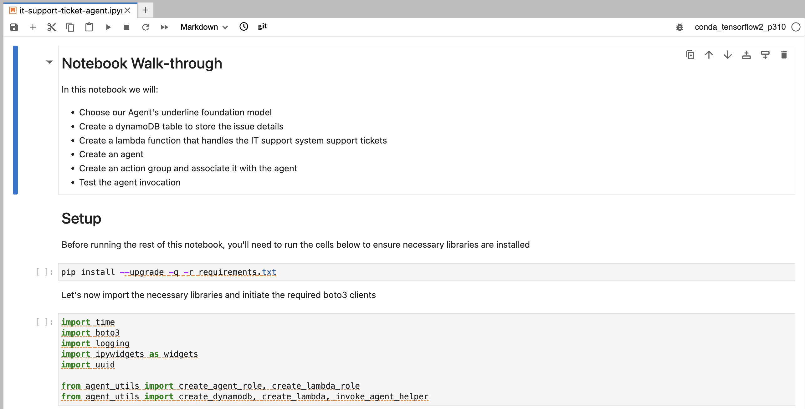

# Agents for Amazon Bedrock - create an IT support ticket agent
In this Lab We will create a IT support system assistant that allows customers to create, delete or get ticket information.  

### How to start
Our lab consist of a notebook provides sample code for building an Agent for Amazon Bedrock that has an Action Group attached to it.
 

1. Go to AWS Sagemaker and select Notebooks **InService**, choose the instance and then choose **Open JupyterLab**.

   


2. In the notebook Launcher select terminal 

   

2. Run git clone

```python
cd /home/ec2-user/SageMaker/ && git clone https://github.com/TeraSky-OSS/bedrock-it-support-ticket-agent.git
```


3. You should see the aws-bedrock-it-agent.git directory in a second or two

   


4. Click on **it-support-ticket-agent.ipynb** jupyter notebook and 

   


5. Once the notebook is open, you can execute the cells one by one.
To execute a cell, you can either:
Click on the cell and then press Shift + Enter.
Click on the "Run" button in the toolbar at the top of the notebook.

6. Monitor Output - As you execute each cell, the output will appear directly below the cell.
To execute a cell, you can either:
  - Click on the cell and then press `Shift + Enter`.
  - Click on the "Run" button in the toolbar at the top of the notebook.


## [Back to Labs](https://github.com/TeraSky-OSS/aws-bedrock-llm-workshop/tree/main?tab=readme-ov-file#labs-overview)
