# AWS Bedrock Knowledge Base Lab

This guide provides step-by-step instructions to set up an AWS Bedrock Knowledge Base using the AWS Management Console. Follow the steps below to quickly create your Knowledge Base and integrate it with a vector database for retrieval-augmented generation (RAG).


### Lab Scenario:

In this lab, we are working with ABC_Corp, which has a document titled `ABC_Corp_Security_Policy.pdf` that outlines their security policies and best practices. Our goal is to create a Knowledge Base (KB) that can provide insights and recommendations on recently created IAM policies within their AWS environment.

#### Scenario Steps:

1. **Access the Security Policy Document:**
   - ABC_Corp has stored their `ABC_Corp_Security_Policy.pdf` document in an S3 bucket, which can be accessed via the following URL:
     [https://abc-corp-knowledge.s3.amazonaws.com/ABC_Corp_Security_Policy.pdf](https://abc-corp-knowledge.s3.amazonaws.com/ABC_Corp_Security_Policy.pdf).

2. **Create a New S3 Bucket:**
   - We will generate a random number to create a unique S3 bucket named `abc-corp-kb-${random_num}` where `${random_num}` is a placeholder for the randomly generated number.

 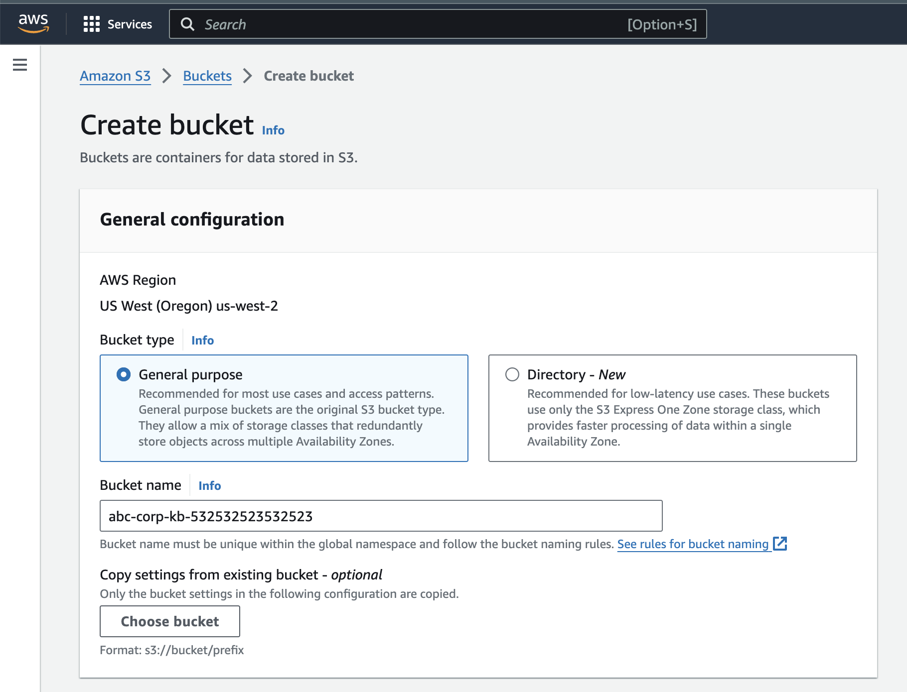
  

3. **Copy the Security Policy Document:**
   - Once the bucket is created, we will copy the `ABC_Corp_Security_Policy.pdf` from the source URL into this newly created S3 bucket. This step ensures that the document is available within our environment for further processing and analysis.

 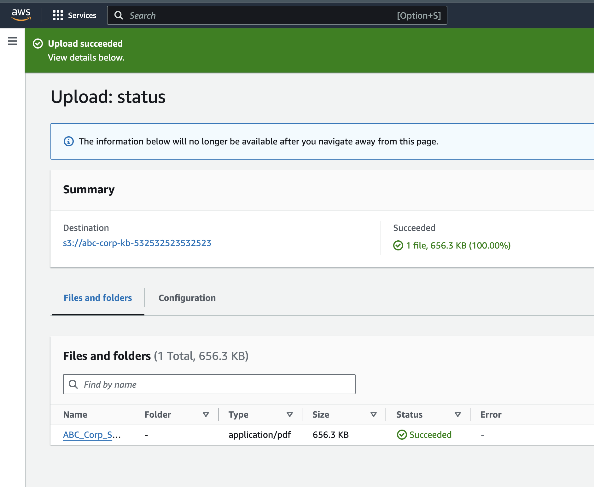


#### Expected Outcome:
By the end of this lab, you will have successfully created a KB that can automatically provide security insights into IAM policies, ensuring they align with ABC_Corp's security standards. This will help in maintaining a secure and compliant AWS environment for ABC_Corp.


## 1. Go to AWS Bedrock Console
- Search for "Bedrock" in the AWS Management Console search bar and open the Bedrock service.

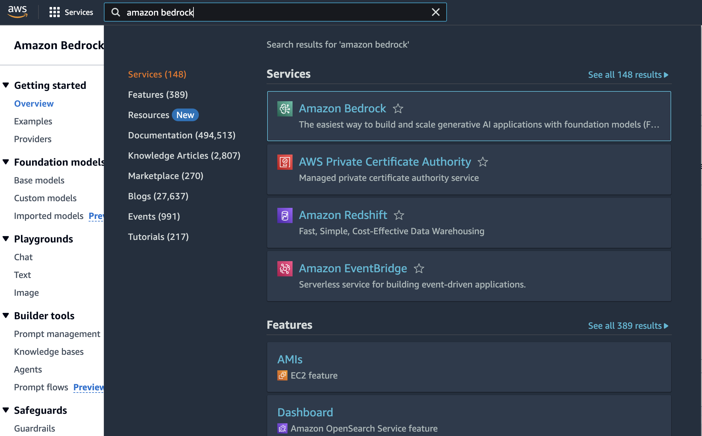


## 2. Create Knowledge Base
- Open the left-hand side menu and click on "Knowledge Base."


- Click "Create Knowledge Base."

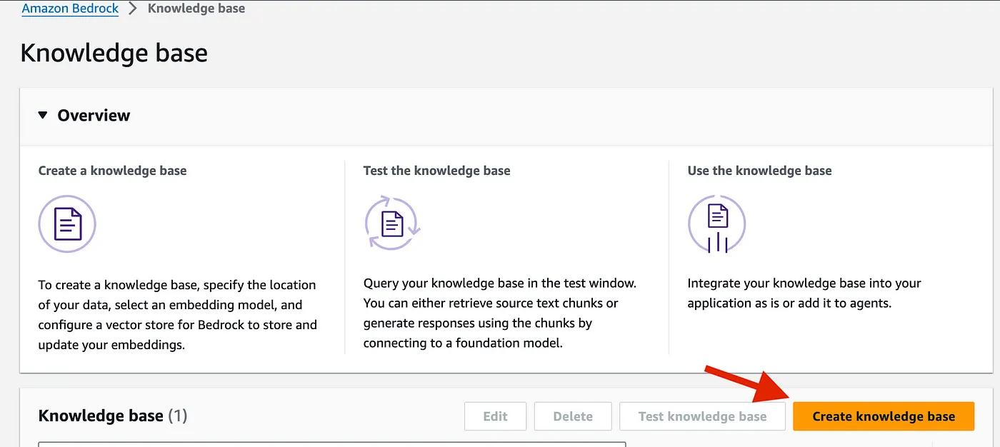


- Input the Knowledge Base name.
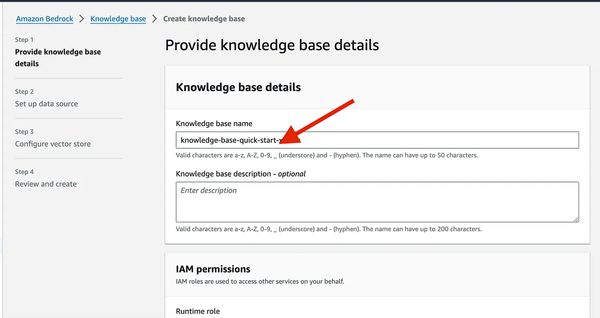


- Select "Create and use a new service role."


## 3. Configure Data Source

- Select the S3 data source


- Input the "Data source name" and select the S3 bucket where you have uploaded ABC_Corp_Security_Policy.pdf file


## 4. Configure Vector Store
- Choose an embeddings model to convert the data that you will provide in the next step, and provide details for a vector data store in which Bedrock can store, manage, and update your embeddings

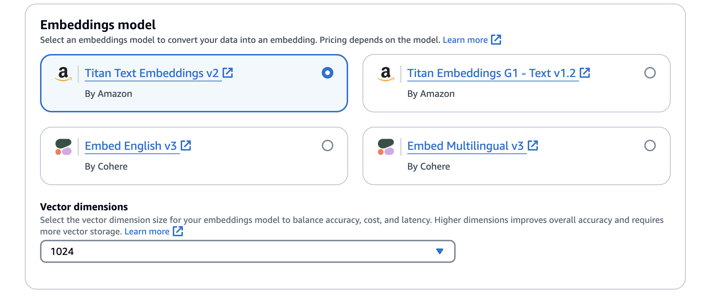

## 5. Configure Vector Store
- Choose the option "Quick create a new vector store — Recommended." This will set up a vector database in Amazon OpenSearch for your knowledge base (this one is a bit costly , so keep in mind)


## 6. Review and Create
- Review the configuration on the left-hand side steps diagram.
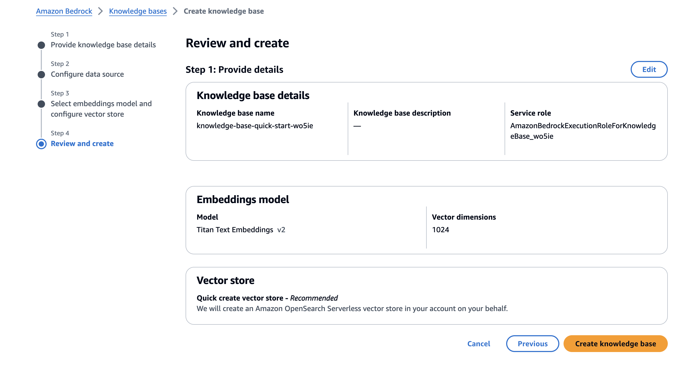

- Click "Create Knowledge Base." It should take a few minutes to create the vector database in Amazon OpenSearch.


## 7. Sync Data Source
- We now need to sync our data sources so relevant information will be returned when querying a Knowledge base.


- Click on "Sync"


## 8. Prep test Knowledge Base
- Once the Knowledge Base is created, look for the "Test knowledge base" box on the right-hand side.


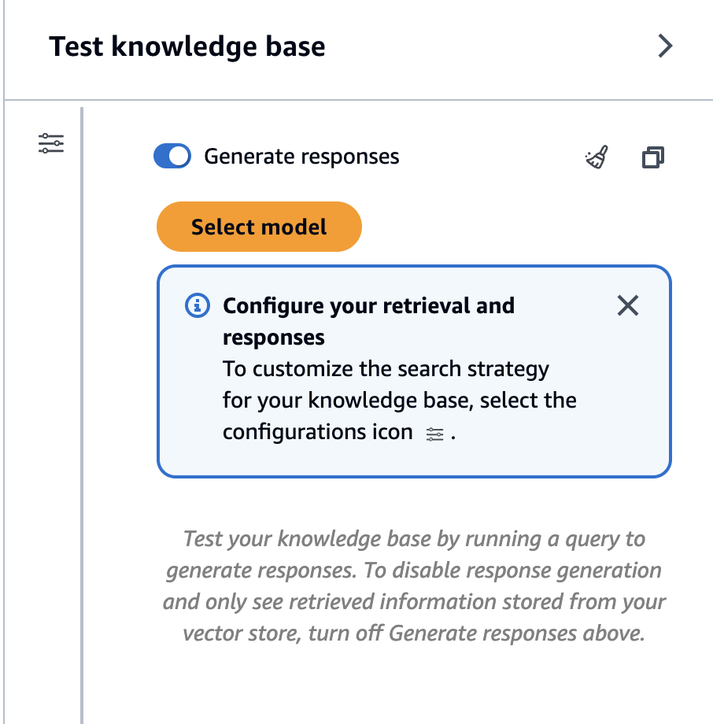


- Click "Select Model," select Claude 2 v2 and then try to ask questions using the input box below.


## 9. Let's dive in 


### Prompt 0:

```json

What knowledge do you have about finance ?

```

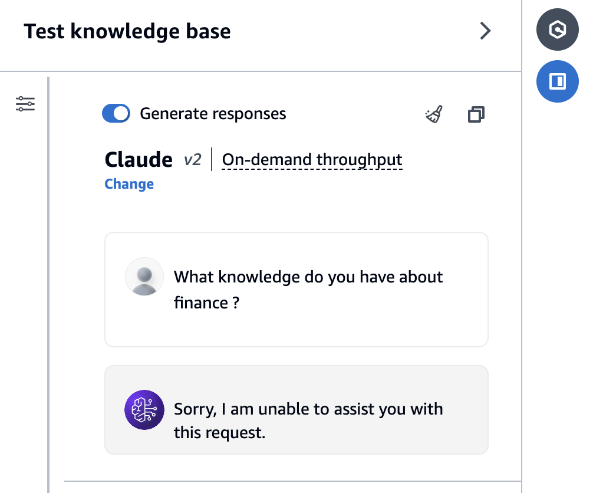


```json

What knowledge do you have about security ?

```


### Prompt 1:

At this point it's seems our agent know something about security , so let's ask something ...

```json

give me one most important current security risk in the following IAM policy:


{
    "Version": "2012-10-17",
    "Statement": [
        {
            "Effect": "Allow",
            "Action": [
                "s3:ListBucket",
                "s3:GetObject"
            ],
            "Resource": [
                "arn:aws:s3:::example-bucket",
                "arn:aws:s3:::example-bucket/*"
            ]
        },
        {
            "Effect": "Allow",
            "Action": [
                "ec2:StartInstances",
                "ec2:StopInstances",
                "ec2:DescribeInstances"
            ],
            "Resource": [
                "arn:aws:ec2:region:account-id:instance/instance-id"
            ]
        }
    ]
}

```

- take a look on the agent response and click on  **Show source details >**

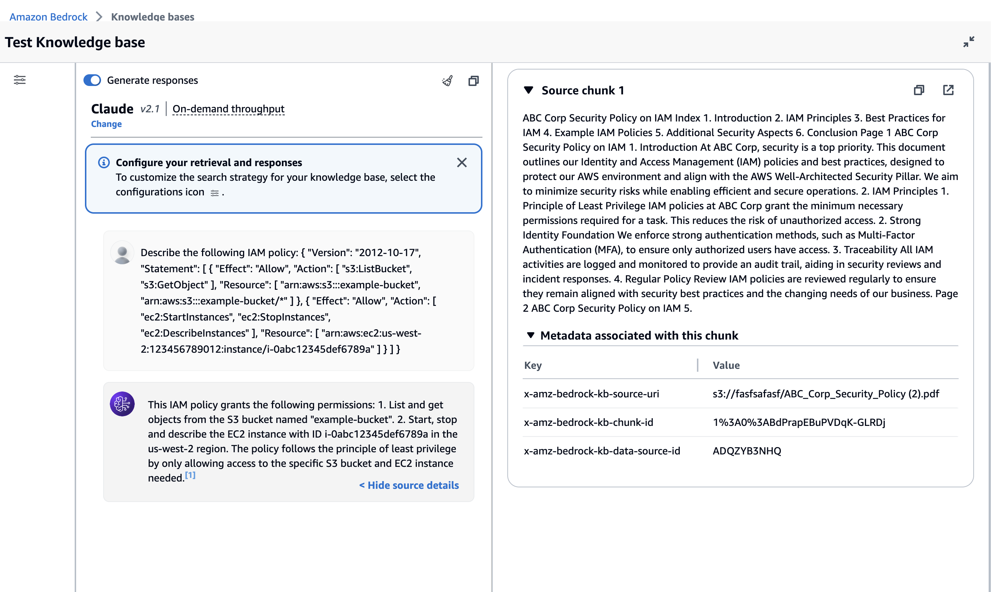


### Prompt 2:

```json
Does the following policy follow the Principle of Least Privilege?

Answer in Yes or No.

**Policy IAM policy:**


{
    "Version": "2012-10-17",
    "Statement": [
        {
            "Effect": "Allow",
            "Action": [
                "s3:ListBucket",
                "s3:GetObject"
            ],
            "Resource": [
                "arn:aws:s3:::example-bucket",
                "arn:aws:s3:::example-bucket/*"
            ]
        },
        {
            "Effect": "Allow",
            "Action": [
                "ec2:DescribeInstances"
            ],
            "Resource": "*"
        }
    ]
}

```


- take a look on the agent response , the answer is Yes but I don't think it's true.
What are we missing here ? 

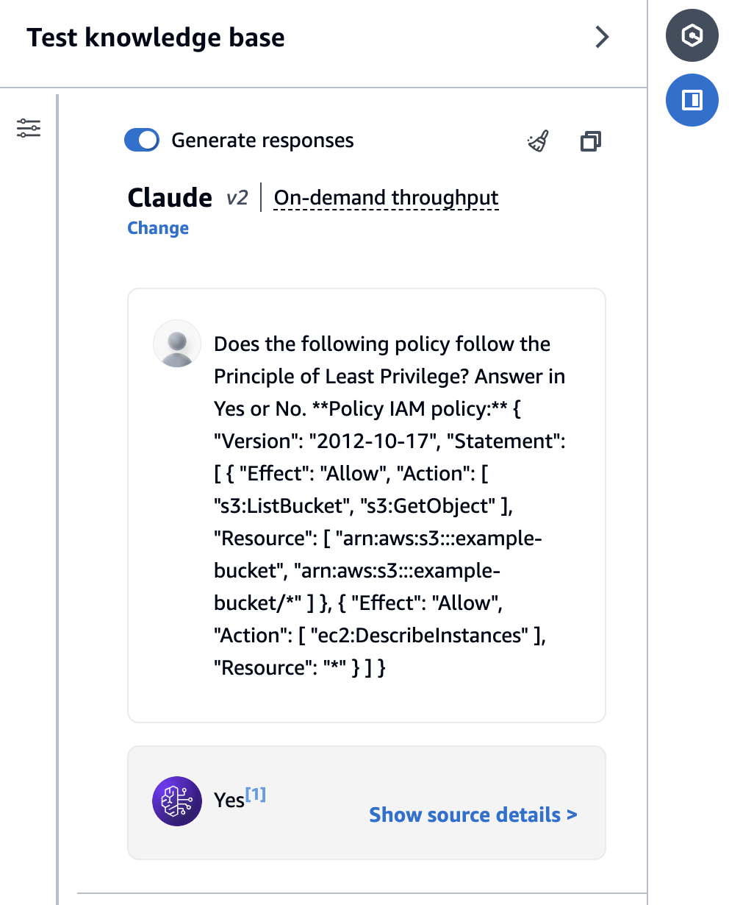


### Prompt 2 - Take 2:

```json
Does the following policy follow the Principle of Least Privilege? noting that there may be multiple items in the policy statement. 
{
    "Version": "2012-10-17",
    "Statement": [
        {
            "Effect": "Allow",
            "Action": [
                "s3:ListBucket",
                "s3:GetObject"
            ],
            "Resource": [
                "arn:aws:s3:::example-bucket",
                "arn:aws:s3:::example-bucket/*"
            ]
        },
        {
            "Effect": "Allow",
            "Action": [
                "ec2:DescribeInstances"
            ],
            "Resource": "*"
        }
    ]
}


```


- take a look on the agent response , the answer is Yes but I don't think it's true.
What are we missing here ? 

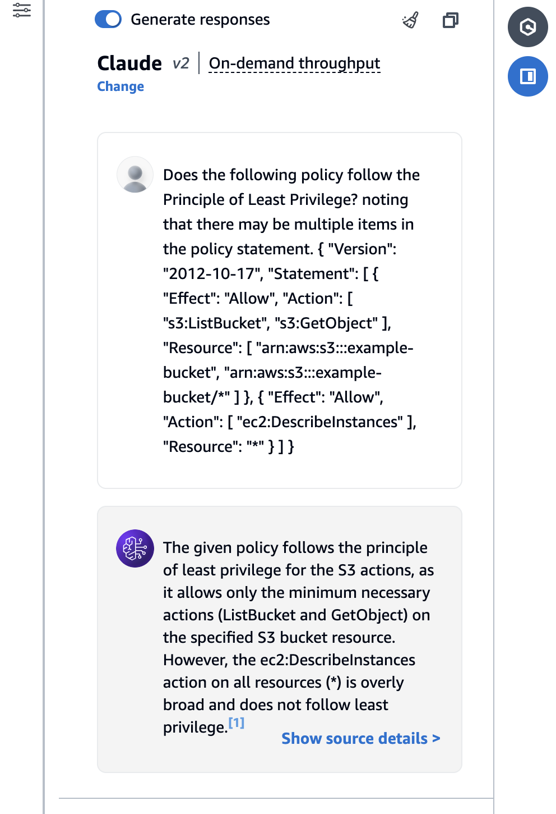


## [Back to Labs](https://github.com/TeraSky-OSS/aws-bedrock-llm-workshop/tree/main?tab=readme-ov-file#labs-overview)