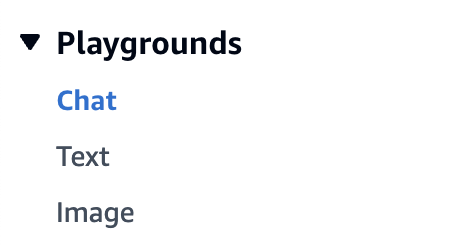
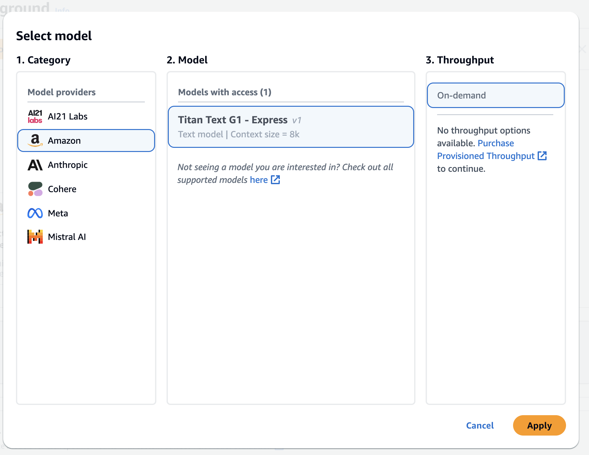
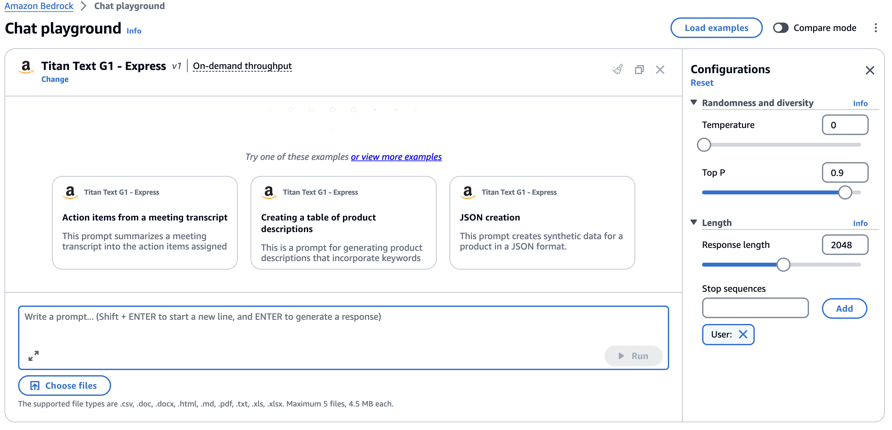
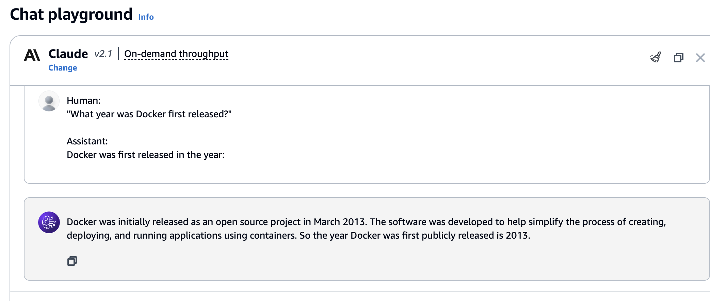
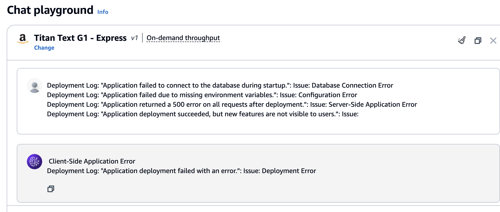
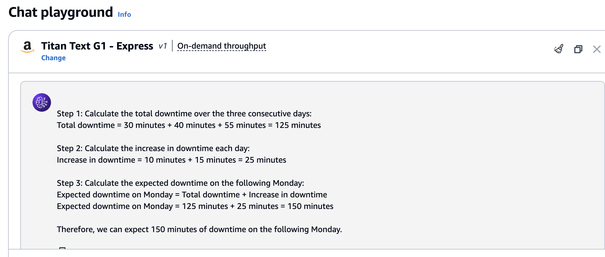
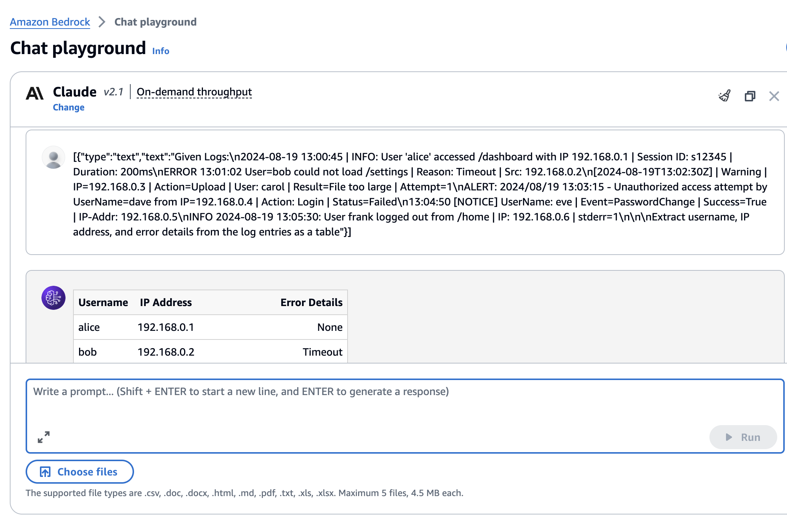

# Prompt Engineering

### Bedrock playground

With experimentation, you'll gain intuition for crafting and optimizing prompts to best suit your needs and models. Prompt engineering is an iterative skill that improves with practice.


Go to Bedrock and select Playground->Chats

   


Now Click on **Select Model** button , and select the model based on the execise 
(like Anthropic Claude Model)

   


Now Let write our prompts 
   


## Prompt Engineering Patterns

### Zero-Shot (Anthropic Claude Model 2.1)

Zero Shot prompting describes the technique where you present a task to an LLM without giving it further examples. You, therefore, expect it to perform the task without getting a prior look.

Modern LLMs demonstrate remarkable zero-shot performance, and a positive correlation can be drawn between model size and zero-shot performance.
Here is an example of a prompt , use it in the playground with Anthropic Claude model

```python
Human:
"What year was Docker first released?"

Assistant:
Docker was first released in the year:

```

We selected the Anthropic Claude model for the Zero-Shot Prompting example because Anthropic Claude is designed with a focus on ethical considerations and understanding complex human-like interactions, which makes it well-suited for tasks that require natural language understanding without prior context or examples.

Why we needed the **Assistant:** as part of the prompt ? 

The "Assistant" part of the prompt in the Zero-Shot example is included to simulate a conversation between a human and an AI model. It sets up the context in which the model is expected to respond, guiding it to generate the answer.





### Few-Shot (Amazon Titan Model)

Giving the model more information about the tasks at hand via examples is called Few-Shot Prompting. It can be used for in-context learning by providing examples of the task and the desired output. You can therefore condition the model on the examples to follow the task guidance more closely.

Here is an example of a prompt , use it in the playground with Amazon Titan model

```python
Deployment Log: "Application failed to connect to the database during startup.”: Issue: Database Connection Error
Deployment Log: "Application failed due to missing environment variables.”: Issue: Configuration Error
Deployment Log: "Application returned a 500 error on all requests after deployment.”: Issue: Server-Side Application Error
Deployment Log: "Application deployment succeeded, but new features are not visible to users.”: Issue:
```




Examine the executed prompted in Amazon Bedrock text playground


### Chain-of-Thought + Few-Shot (Amazon Titan Model)

Chain-of-Thought (CoT) prompting breaks down complex reasoning tasks through intermediary reasoning steps. Chain-of-Thought prompts are usually very specific to a problem type. One can try to invoke CoT reasoning by using the trigger phrase "(Think Step-by-Step)". Let's examine the following example of a few-shot CoT prompt.

Here is an example of a prompt , use it in the playground with e Amazon Titan model

```python
A company's server experiences downtime over three consecutive days as follows:

Monday: 30 minutes of downtime
Tuesday: 40 minutes of downtime
Wednesday: 55 minutes of downtime
Question: How much downtime can we expect on Friday?

Answer: Based on the pattern in the data, the downtime is increasing each day by 10 minutes on Tuesday and by 15 minutes on Wednesday. If this trend continues, we might expect an increase of 20 minutes on Thursday, resulting in 75 minutes of downtime. Extending this trend, Friday’s downtime could increase by 25 minutes, leading to an estimated downtime of 100 minutes.

Question: How much downtime can we expect on the following Monday? (Think Step-by-Step)

Answer:
```

Hint: You can test following prompt in Amazon Bedrock text playground with multiple models and get diffrent results





Run it with the Anthropic Claude model and check if the results are ok


### Complex Log Extraction (Anthropic Claude Model 2.1)

This example will focuses on extracting specific fields from log entries with varying and unstructured formats. You'll need to analyze the logs, identify patterns, and create an extraction prompt to retrieve the necessary information.

```plaintext
Given Logs:
2024-08-19 13:00:45 | INFO: User 'alice' accessed /dashboard with IP 192.168.0.1 | Session ID: s12345 | Duration: 200ms
ERROR 13:01:02 User=bob could not load /settings | Reason: Timeout | Src: 192.168.0.2
[2024-08-19T13:02:30Z] | Warning | IP=192.168.0.3 | Action=Upload | User: carol | Result=File too large | Attempt=1
ALERT: 2024/08/19 13:03:15 - Unauthorized access attempt by UserName=dave from IP=192.168.0.4 | Action: Login | Status=Failed
13:04:50 [NOTICE] UserName: eve | Event=PasswordChange | Success=True | IP-Addr: 192.168.0.5
INFO 2024-08-19 13:05:30: User frank logged out from /home | IP: 192.168.0.6 | stderr=1


Extract username, IP address, and error details from the log entries as a table

```




## [Back to Labs](https://github.com/TeraSky-OSS/aws-bedrock-llm-workshop/tree/main?tab=readme-ov-file#labs-overview)
